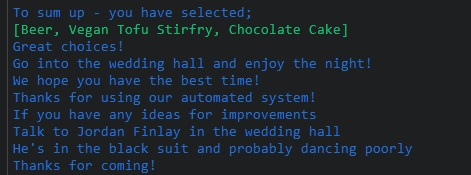

# UX

I've created a backend python script that is a pretend wedding check-in.
This backend script could be used in multiple other scenarios.
In this certain circumstance I created it for a wedding check-in function.
In short, when the user arrives at the wedding, they check in with their name, what drink they'd like, what main dish they'd like (also with vegan or non vegan options) it then gives an option of a second drink before/with dessert and what your dessert pick is. Before the end, it has an option to request a song and finally ends with a results function that shows the user every item they have picked for the wedding.

After each function there's a validation check to ensure the users response is correct.

I was originally going to create a restaurant idea with similar functions that would check the customer in whilst taking their drinks and food order. It was my girlfriends idea for a wedding design as it maybe more fun than a basic restaurant idea, thanks Jo!

# Flowchart

- I created a flowchart before anything to make some easy steps for myself as to how I'd like the project to look and run
- I added some small changes as I created my script where I thought necessary
- I tried to keep the idea simple but effective. Getting staight to the point and running through the menu quickly and efficiently

 

# Features

__Existing Features__

- A fully functioning backend python script to check in the user and generate a menu that includes;
	- Name (first and last)
	- Drinks menu
	- Main dish (vegan or non vegan)
	- An option for a second drink
	- A dessert menu (again vegan or non vegan)
	- A song choice
	- A results print of all options picked

- There are validation checks after every function to ensure names inputted can't be made with numbers or be too short (such as a single letter)
  - Other validation checks are to ensure users are picking correct numbers from the lists they are given and if they pick anything else the function will restart and provides a message to
  pick a number from the list

 

 

# Features Left to Implement

I have a few ideas I would love to add to this project such as:

- A random number generator to pick a table number for guests
- A spreadsheet for data to be sent to and stored
- On a spreadsheet, have the names of all guests and visabily tick them off when they enter their name into the system

# Testing

I've tested my Wedding Checker on multiple browers such as Firefox/Chrome and Microsoft edge. As well as my android phone using "Samsung internet".
To my current knowledge there are no bugs on any device or internet browser - although I'm still yet to test fully on an ipad/tablet.
The website is fully adaptable to all devices and screen sizes.

- Firefox
  - Script works as intended

- Chrome
  - Script works as intended

- Microsoft edge
  - Script works as intended

## Mobile testing

- Firefox (mobile)
  - Script works as intended

- Chrome (mobile)
  - Script works as intended

- Microsoft edge (mobile)
  - Script works as intended

# Validator Testing
I used CI Python Linter for validation checks: <https://pep8ci.herokuapp.com/#>
All checks are passed and it's running smoothly

# Bugs
I've been lucky and not encountered many bugs whilst making this project.
I did get one where it turned my scipt into 'null'. I've no idea why it did, but I reloaded my old script which resulted in some lost code, but I continued just fine.

# Deployment

- The site was deployed to GitHub pages. The steps to deploy are as follows:
  - In the GitHub repository, navigate to the Settings tab
  - From the source section drop-down menu, select the Master Branch
  - Once the master branch has been selected, the page will be automatically refreshed with a detailed ribbon display to indicate the successful deployment.

The live link can be found here - <https://github.com/Jordan-Finlay/Wedding-Checker>

## Local deployment

- I've downloaded a copy of my wedding checker script onto my computer and am able to access it through local deployment to change and mess around with the overall code and layout/structure for better user experience. I've also installed python that allows me to work on my code as if it was running through code anywhere.

# Credits

__Content__

- I used Colorama for colours - https://pypi.org/project/colorama/
- Other than that, everything is backend and I've not used any third parties for any logos/design/pictures etc
